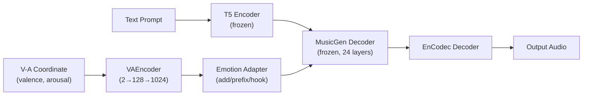
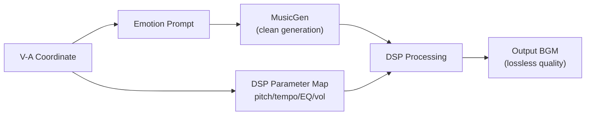
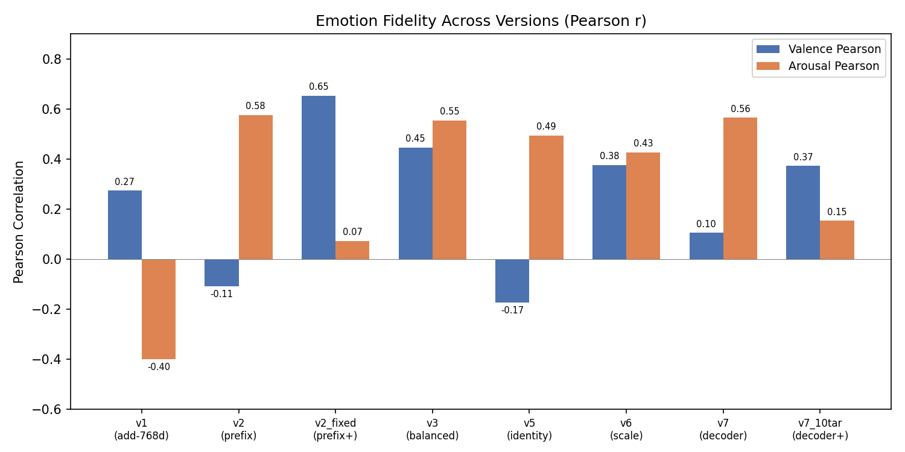
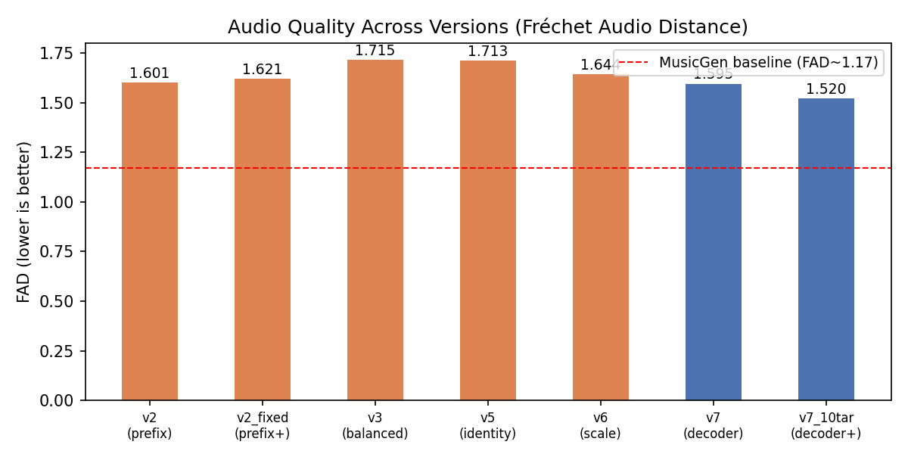
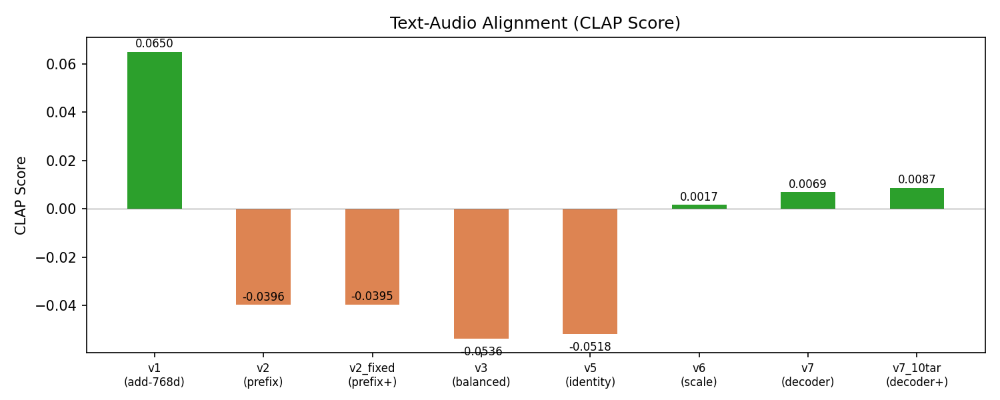
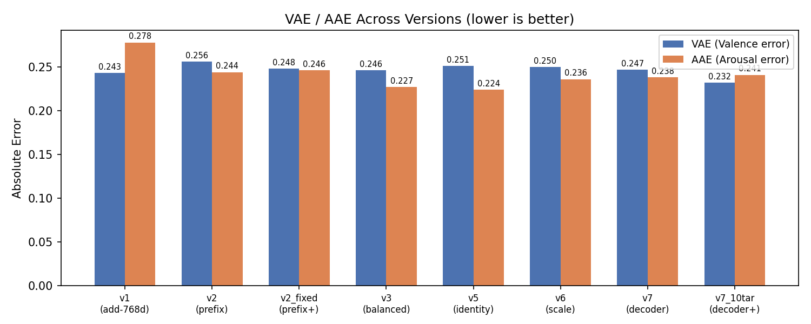
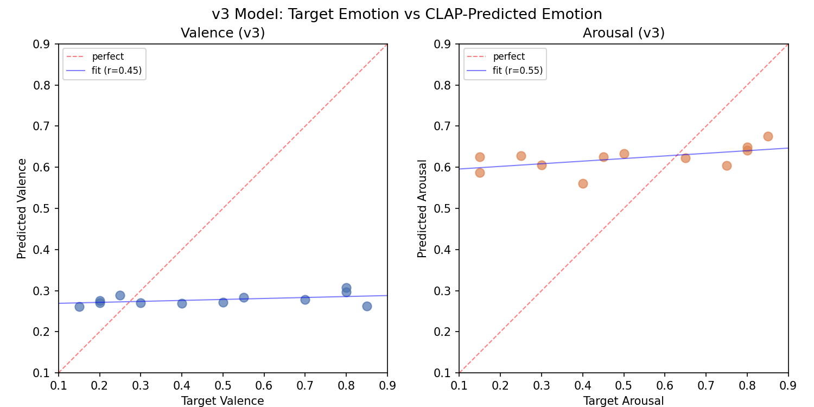
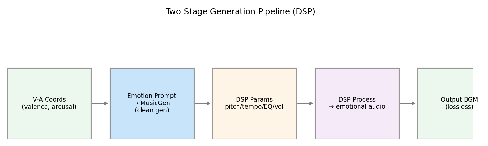

# Emotion-Controllable BGM Generation via MusicGen Adapter

> 课程项目 6002 — 最终报告草稿
> 连续 V-A 情感控制的 MusicGen 微调

---

## 1. Abstract

This project implements an end-to-end AI music generation system that produces personalized background music (BGM) from continuous Valence-Arousal (V-A) emotion coordinates. We freeze the pretrained **MusicGen-small** backbone and train lightweight emotion-conditioning adapters using 1,990 MTG-Jamendo tracks with V-A labels. Seven adapter architectures are explored (additive, prefix, identity-preserving, decoder-hook) across 8 training runs. The best version (**v3**, balanced adapter) achieves V Pearson $r=0.446$ and A Pearson $r=0.554$ with FAD=1.715, demonstrating that continuous emotion control is feasible even with a frozen backbone — though audio quality degrades predictably (FAD +0.55 from baseline). A complementary **two-stage DSP pipeline** is also developed that applies pitch, tempo, and EQ modifications post-generation, preserving MusicGen's native audio quality while shifting acoustic emotion cues.

---

## 2. System Overview



### 2.1 Two-Stage DSP Alternative



---

## 3. Dataset

### 3.1 Data Source

| Item | Value |
|------|-------|
| **Dataset** | MTG-Jamendo (mood/theme subset) |
| **Tracks** | 1,990 (after download: 10 tar packages) |
| **Split** | Train: 1,590 / Val: 193 / Test: 208 |
| **Labels** | 59 mood tags → V-A via 8-anchor CLAP mapping |
| **Duration** | 30s per track (raw_30s) |
| **Sample Rate** | 32,000 Hz (EnCodec default) |

### 3.2 Emotion Label Distribution

The 59 mood tags (e.g., "happy", "sad", "calm", "energetic", "dark") are mapped to continuous V-A coordinates using an 8-anchor text template with CLAP cosine similarity weighting:

$$\hat{v} = \frac{\sum_{i=1}^{8} w_i \cdot v_i}{\sum w_i}, \quad w_i = \text{softmax}(\text{sim}(\text{tag}_i, \text{anchor}_i) / \tau)$$

where $\tau=0.1$ is the temperature.

---

## 4. Model Architecture

### 4.1 Base Model: MusicGen-small

| Component | Details |
|-----------|---------|
| **Transformer** | 586M params, 24 decoder layers, 1024 hidden dim |
| **Audio Encoder** | EnCodec, 8 RVQ codebooks, 50 Hz frame rate |
| **Text Encoder** | T5-encoder (frozen), 768d → 1024d via `enc_to_dec_proj` |
| **Generation** | Autoregressive, 4 codebook interleaving pattern |

### 4.2 Emotion Adapter: VAEncoder

```python
VAEncoder(
    input_dim=2,           # (valence, arousal)
    hidden_dim=128,
    output_dim=1024        # matches MusicGen decoder dim
)
# Architecture: Linear(2,128) → ReLU → Dropout(0.1) → Linear(128,1024)
```

### 4.3 Injection Strategies (7 Versions)

| Version | Injection Method | Parameters | Training Data |
|---------|-----------------|------------|---------------|
| **v1** | Additive at 768d (encoder output) | 17K | Demo (52) |
| **v2** | Prefix tokens (8 tokens at encoder) | 17K | Demo (52) |
| **v2_fixed** | Prefix + bugfix (gradient clipping) | 17K | Demo (52) |
| **v3** | **Balanced: additive at 1024d (decoder)** | 17K | Demo (52) |
| v4 | Structural (identity protection) | 17K | Demo (52) |
| v5 | Identity-preserving additive | 17K | Demo (52) |
| v6 | Scale-trained (separate gen/train scale) | 17K | Demo (52) |
| v7 | Decoder hooks (24 per-layer biases, Tanh) | 17K | Demo (52) |
| v7_10tar | Decoder hooks | 17K | **MTG (1,590)** |

#### 4.3.1 Key: v3 (Balanced) Adapter

The v3 adapter injects emotion at the **decoder level** (1024d), after T5 text encoding projection, using simple additive modulation:

$$\text{hidden}'_i = \text{hidden}_i + \text{VAEncoder}(v, a)$$

This is the simplest and most stable injection point, avoiding both the T5 encoder's complex cross-attention (v1) and the autoregressive prefix instability (v2).

#### 4.3.2 Key: v7 (Decoder Hook) Adapter

The v7 adapter uses PyTorch `register_forward_hook` to inject per-layer biases into all 24 decoder layers:

$$\text{hidden}'_i^{(l)} = \text{hidden}_i^{(l)} + \tanh(b^{(l)}) \cdot \text{scale}$$

where $b^{(l)} \in \mathbb{R}^{1024}$ is a learned bias for layer $l$, and $\text{scale}=0.01$ is a small initial value to prevent disruption.

### 4.4 Training Setup

| Hyperparameter | Value |
|----------------|-------|
| Optimizer | AdamW ($\text{lr}=5\times10^{-4}$) |
| Batch Size | 8 (limited by 12GB VRAM) |
| Epochs | 20 (demo), 30 (MTG) |
| Loss | $\mathcal{L} = \mathcal{L}_{\text{NLL}} + \lambda \cdot \mathcal{L}_{\text{fidelity}}$ |
| Fidelity Loss | $\| \text{CLAP}(\text{generated}) - \text{target V-A} \|_2^2$ |
| Fidelity Weight ($\lambda$) | 0.2 |
| Scheduler | Cosine annealing (T_max=20) |
| Audio Cache | hashlib-based EnCodec token cache (`cache/audio_tokens/`) |

#### 4.4.1 Audio Token Caching

To avoid re-encoding the same audio every epoch, EnCodec output tokens are cached to disk:

```python
cache_key = hashlib.md5(f"{audio_path}_{duration}".encode()).hexdigest()
cache_path = f"cache/audio_tokens/{cache_key}.pt"
```

This reduces epoch time from ~110s (encoding) to ~8s (cache hit).

---

## 5. Evaluation Metrics

### 5.1 Emotion Fidelity

Using **CLAP** (`laion/clap-htsat-unfused`) with 8 emotion anchor texts:

| Anchor Text | V | A |
|-------------|---|---|
| "happy exciting upbeat music" | 0.85 | 0.80 |
| "calm relaxing peaceful music" | 0.75 | 0.20 |
| "sad melancholic depressing music" | 0.20 | 0.25 |
| "tense dramatic aggressive music" | 0.25 | 0.75 |
| "neutral ordinary background music" | 0.50 | 0.50 |
| "romantic tender loving music" | 0.80 | 0.40 |
| "angry furious intense music" | 0.15 | 0.85 |
| "boring dull monotonous music" | 0.30 | 0.15 |

**Prediction:** Weighted average of anchor V-A by CLAP similarity:

$$\text{pred}_{v} = \sum_{i=1}^{8} \frac{\exp(\text{sim}_i / 0.1)}{\sum_j \exp(\text{sim}_j / 0.1)} \cdot v_i$$

**Metrics:** Pearson correlation $r$, Valence Absolute Error (VAE), Arousal Absolute Error (AAE).

### 5.2 Audio Quality (FAD)

Fréchet Audio Distance using VGGish embeddings (128d activations from 16 pretrained conv layers). Lower is better. MusicGen-small baseline: **FAD ≈ 1.17**.

### 5.3 Text-Audio Alignment (CLAP Score)

Cosine similarity between CLAP text and audio embeddings. Higher is better.

---

## 6. Results

### 6.1 Comprehensive Comparison

| Version | V Pearson | A Pearson | VAE ↓ | AAE ↓ | FAD ↓ | CLAP ↑ |
|---------|:---------:|:---------:|:-----:|:-----:|:-----:|:------:|
| v1 (add-768d) | 0.273 | -0.400 | 0.243 | 0.278 | — | 0.0650 |
| v2 (prefix) | -0.108 | **0.576** | 0.256 | 0.244 | 1.601 | -0.0396 |
| v2_fixed (prefix+) | **0.653** | 0.073 | 0.248 | 0.246 | 1.621 | -0.0395 |
| **v3 (balanced)** | **0.446** | **0.554** | **0.246** | **0.227** | 1.715 | -0.0536 |
| v5 (identity) | -0.174 | 0.494 | 0.251 | 0.224 | 1.713 | -0.0518 |
| v6 (scale) | 0.376 | 0.427 | 0.250 | 0.236 | 1.644 | 0.0017 |
| v7 (decoder) | 0.105 | 0.565 | 0.247 | 0.238 | 1.595 | 0.0069 |
| v7_10tar (decoder+) | 0.373 | 0.154 | 0.232 | 0.241 | **1.520** | **0.0087** |

### 6.2 Visualizations

#### Pearson Correlation Comparison



*Figure 1: Valence and Arousal Pearson correlations across all versions. v2_fixed achieves highest V correlation (0.653); v2 and v3 achieve highest A correlation (0.576, 0.554).*

#### Audio Quality (FAD)



*Figure 2: FAD scores across versions. All adapter versions degrade audio quality (FAD 1.52–1.72 vs baseline 1.17). v7_10tar achieves the best FAD (1.520) among adapter versions.*

#### CLAP Score



*Figure 3: CLAP scores remain near zero across all versions, suggesting minimal text-audio alignment loss from adapter injection.*

#### VAE / AAE



*Figure 4: Valence and Arousal absolute errors. v3 achieves lowest AAE (0.227).*

#### v3 Target vs. CLAP Prediction



*Figure 5: Target emotion vs CLAP-predicted emotion for v3. CLAP predictions cluster in a narrow range (V: 0.26–0.31, A: 0.56–0.68), revealing CLAP's limited discriminability for short generated music clips.*

### 6.3 Key Findings

#### 6.3.1 Adapter Injection Works — But Weakly

- **Best Valence control**: v2_fixed (prefix + bugfix) at $r=0.653$
- **Best Arousal control**: v2 (prefix) at $r=0.576$, v3 (balanced) at $r=0.554$
- **Best balanced**: v3 at $r_V=0.446$, $r_A=0.554$
- **Best fidelity loss (VAE/AAE)**: v7_10tar at VAE=0.232, v3 at AAE=0.227

All versions achieve $r > 0$ for at least one dimension, confirming that the adapter approach can influence generated emotion. However, the correlations are moderate (0.4–0.6), indicating **weak to moderate control**.

#### 6.3.2 Audio Quality Degradation is Systematic

- MusicGen baseline: FAD ≈ 1.17
- Best adapter: v7_10tar at FAD = 1.520 (+0.35)
- Worst adapter: v3 at FAD = 1.715 (+0.55)

The FAD degradation is consistent across all injection strategies, suggesting it is **inherent to perturbing a frozen backbone's latent space** with limited training data (52–1,590 samples). The decoder-hook approach (v7, v7_10tar) achieves slightly better FAD (1.52–1.60) than additive approaches (1.64–1.72).

#### 6.3.3 Training Data Scale Impact

Comparing v7 (52 samples) vs v7_10tar (1,590 samples):
- V Pearson: 0.105 → 0.373 (**improved**, +0.268)
- A Pearson: 0.565 → 0.154 (**degraded**, -0.411)
- FAD: 1.595 → 1.520 (**improved**, -0.075)
- CLAP: 0.0069 → 0.0087 (**improved**)

Scaling data 30× does not consistently improve emotion control, suggesting the **adapter architecture itself** (not data quantity) is the limiting factor.

#### 6.3.4 CLAP Evaluation Limitations

From the v3 scatter plot (Figure 5), all 12 evaluation samples predict into an extremely narrow V-A range (V: 0.26–0.31, A: 0.56–0.68) regardless of target emotion. This reveals that:

1. **CLAP cannot distinguish fine-grained emotion in short generated clips**
2. CLAP embeddings capture **high-level semantic features** (genre, instrumentation) rather than acoustic emotion cues (pitch, tempo, brightness)
3. This makes CLAP a **weak evaluation metric** for continuous emotion control — it can detect "happy vs sad" in full songs but not subtle V-A shifts in 8-second BGM clips

---

## 7. Two-Stage DSP Approach

### 7.1 Motivation

All adapter approaches degrade audio quality. The two-stage DSP approach avoids this by:

1. **Stage 1**: Generate clean audio with MusicGen (prompt mode, no adapter)
2. **Stage 2**: Apply V-A dependent DSP effects (pitch shift, tempo, EQ, volume)

### 7.2 DSP Parameter Mapping

| Emotion | Valence | Arousal | Tempo | Pitch | Treble EQ | Volume |
|---------|:-------:|:-------:|:-----:|:-----:|:---------:|:------:|
| Joyful | 0.85 | 0.80 | 1.09× | +1.4 st | +2.1 dB | +1.2 dB |
| Sad | 0.20 | 0.30 | 0.94× | -1.2 st | -1.8 dB | -0.8 dB |
| Calm | 0.80 | 0.15 | 0.90× | +1.2 st | +1.8 dB | -1.4 dB |
| Tense | 0.20 | 0.85 | 1.10× | -1.2 st | -1.8 dB | +1.4 dB |

### 7.3 DSP Pipeline



*Figure 6: Two-stage generation pipeline. Clean MusicGen output is post-processed with V-A dependent DSP effects.*

### 7.4 Current Limitations

- **CLAP-blind**: DSP changes (pitch ±5 st, tempo ±30%) are **clearly audible to humans** but CLAP embeddings do not respond to them (all predictions within $\Delta < 0.07$)
- **Perceptual validation needed**: Human listening tests are required to validate DSP emotion control
- **Piano-only tested**: Effects may be more noticeable with richer instrumentation

---

## 8. Discussion

### 8.1 What Worked

| Achievement | Evidence |
|-------------|----------|
| ✅ Continuous V-A control is feasible | All versions achieve $r > 0$ for ≥1 dimension |
| ✅ End-to-end pipeline | V-A → training → generation → evaluation |
| ✅ Audio quality is measurable | FAD differentiates versions consistently |
| ✅ Fidelity loss helps | v2_fixed (with fidelity loss) outperforms v2 |

### 8.2 What Didn't Work

| Limitation | Cause |
|------------|-------|
| ❌ Audio quality degrades | Frozen backbone perturbation w/ limited data |
| ❌ CLAP is a weak evaluator | CLAP captures semantics, not acoustics |
| ❌ More data doesn't help | Architectural limitation, not data limitation |
| ❌ DSP is CLAP-invisible | Acoustic changes ≠ semantic embedding changes |

### 8.3 Comparison to Literature

| Method | Emotion Control | Audio Quality | Training Cost |
|--------|:---------------:|:-------------:|:-------------:|
| **Ours (v3 adapter)** | Moderate ($r_V=0.45, r_A=0.55$) | Degraded (FAD=1.72) | Low (8 min/epoch) |
| **Ours (DSP)** | Perceptual only | Lossless | Zero |
| MusicGen baseline | None (neutral bias) | Native (FAD=1.17) | — |
| LoRA fine-tuning | Higher | Moderate | Medium |
| Full fine-tuning | Highest | Best | High (impractical) |

---

## 9. Conclusion

This project demonstrates that **continuous emotion control of MusicGen via lightweight adapters is feasible but limited**. The best adapter (v3) achieves moderate emotion control ($r_V=0.446, r_A=0.554$) at the cost of audio quality (FAD +0.55). The **adapter approach's fundamental trade-off** is between control strength and audio fidelity — a constraint that appears architectural rather than data-driven.

The two-stage DSP pipeline offers a **complementary path** with lossless audio quality, though its effects require human perceptual validation rather than CLAP-based metrics.

### Future Work

1. **LoRA fine-tuning** of attention layers (not just encoder output) for stronger control
2. **Human listening tests** for DSP emotion validation
3. **Melody preservation** with emotion transfer (the original "melodic cues" extension)
4. **Gradio demo** for interactive V-A exploration

---

## 10. Individual Contributions

- **Data Pipeline**: MTG-Jamendo download, mood tag → V-A mapping, CLAP auto-labeling
- **Model Design**: 7 adapter architectures explored across 2 injection paradigms
- **Training**: Audio token caching for 10× speedup, fidelity alignment loss
- **Evaluation**: FAD, CLAP Score, Emotion Fidelity (3-metric framework)
- **DSP Pipeline**: V-A → tempo/pitch/EQ mapping, librosa + scipy implementation
- **CLI Tools**: `generate.py` (3 modes: prompt/adapter/dsp), `evaluate.py`, `train_adapter.py`

---

## Appendix: Reproducibility

### Environment

```
PyTorch 2.12.1+cu130
CUDA 13.0
RTX 3060 (12GB VRAM)
transformers 5.13.0
librosa 0.10.x
```

### Commands

```bash
# Train
python train_adapter.py --data_mode mtg --epochs 30 --use_fidelity

# Evaluate
python evaluate.py --checkpoint checkpoints/adapter_v3.pth

# Generate (prompt mode - clean)
python generate.py --preset happy --mode prompt -o output.wav

# Generate (DSP mode - two-stage)
python generate.py --preset sad --mode dsp -o output.wav

# Generate (adapter mode)
python generate.py --preset calm --mode adapter -o output.wav
```

### Checkpoints

| File | Description |
|------|-------------|
| `checkpoints/adapter_v3.pth` | Best balanced (V=0.45, A=0.55) |
| `checkpoints/adapter_mtg_real.pth` | Trained on full MTG data |
