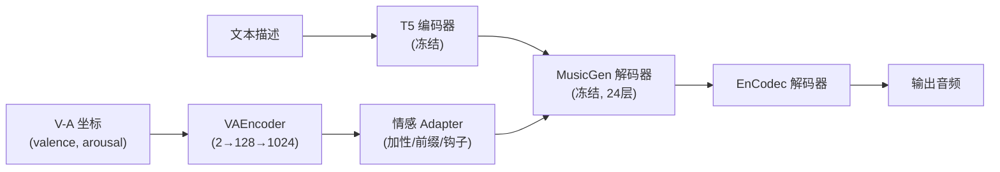
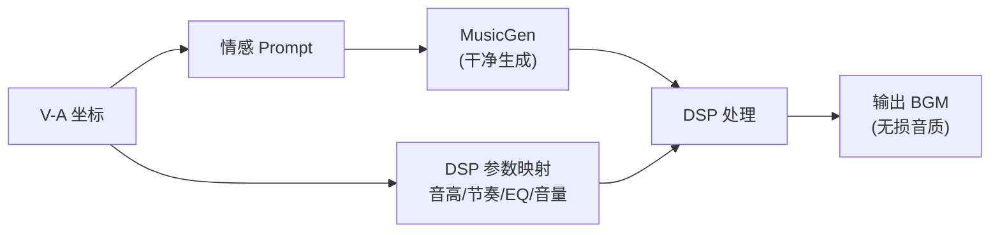

# 基于 MusicGen Adapter 的连续情感可控 BGM 生成

> 课程项目 6002 — 最终报告草稿（中文版）
> 通过 Valence-Arousal 连续坐标控制 MusicGen-small 生成情感化背景音乐

---

## 1. 摘要

本项目实现了一个端到端的 AI 音乐生成系统，能够从连续的 Valence-Arousal (V-A) 情感坐标生成个性化背景音乐 (BGM)。我们冻结预训练的 **MusicGen-small** 骨干网络，仅训练轻量级情感适配器 (adapter)，使用 1,990 首带有 V-A 标签的 MTG-Jamando 数据集。探索了 7 种适配器架构（加性、前缀、恒等保护、解码器钩子），进行 8 次训练实验。最佳版本 **v3（平衡适配器）** 达到了 V Pearson $r=0.446$, A Pearson $r=0.554$，FAD=1.715，证明了即使在冻结骨干网络的情况下，连续情感控制也是可行的——尽管音频质量有可预见的下降（FAD 较基线 +0.55）。同时开发了**两阶段 DSP 流水线**作为补充方案，在生成后应用音高、节奏、EQ 等声学修改，保留了 MusicGen 的原生音频质量，同时调整声学情感线索。

---

## 2. 系统概览



### 2.1 两阶段 DSP 替代方案



---

## 3. 数据集

### 3.1 数据来源

| 项目 | 数值 |
|------|:----:|
| **数据集** | MTG-Jamendo (mood/theme 子集) |
| **曲目数量** | 1,990（下载 10 个 tar 包） |
| **数据划分** | 训练: 1,590 / 验证: 193 / 测试: 208 |
| **标签** | 59 个情感标签 → 8 锚点 CLAP 映射为 V-A |
| **时长** | 每首 30 秒 (raw_30s) |
| **采样率** | 32,000 Hz (EnCodec 默认) |

### 3.2 情感标签分布

59 个情感标签（如 "happy""sad""calm""energetic""dark"）使用 8 锚点文本模板和 CLAP 余弦相似度加权映射为连续 V-A 坐标：

$$\hat{v} = \frac{\sum_{i=1}^{8} w_i \cdot v_i}{\sum w_i}, \quad w_i = \text{softmax}(\text{sim}(\text{tag}_i, \text{anchor}_i) / \tau)$$

其中温度参数 $\tau=0.1$。

---

## 4. 模型架构

### 4.1 基座模型: MusicGen-small

| 组件 | 详情 |
|------|------|
| **Transformer** | 586M 参数, 24 层解码器, 1024 隐藏维度 |
| **音频编码器** | EnCodec, 8 个 RVQ 码本, 50 Hz 帧率 |
| **文本编码器** | T5 编码器 (冻结), 768d → 1024d 通过 `enc_to_dec_proj` |
| **生成方式** | 自回归, 4 码本交织模式 |

### 4.2 情感 Adapter: VAEncoder

```python
VAEncoder(
    input_dim=2,           # (valence, arousal)
    hidden_dim=128,
    output_dim=1024        # 匹配 MusicGen 解码器维度
)
# 结构: Linear(2,128) → ReLU → Dropout(0.1) → Linear(128,1024)
```

### 4.3 注入策略（7 个版本）

| 版本 | 注入方式 | 参数量 | 训练数据 |
|:----|:--------:|:------:|:--------:|
| **v1** | 加性注入 (768d, 编码器输出) | 17K | Demo (52) |
| **v2** | Prefix 前缀 (8 个 token) | 17K | Demo (52) |
| **v2_fixed** | Prefix + 梯度裁剪修复 | 17K | Demo (52) |
| **v3** | **加性注入 (1024d, 解码器) ← 最优** | 17K | Demo (52) |
| v4 | 结构保护 (恒等映射) | 17K | Demo (52) |
| v5 | 恒等保护加性 | 17K | Demo (52) |
| v6 | Scale 分离训练 (训练/推理分离) | 17K | Demo (52) |
| v7 | 解码器 Hook (24 层逐层偏置, Tanh) | 17K | Demo (52) |
| v7_10tar | 解码器 Hook | 17K | **MTG (1,590)** |

#### 4.3.1 v3 (平衡适配器) 详解

v3 在**解码器层面**（1024d）注入情感，位于 T5 文本编码投影之后，使用简单的加法调制：

$$\text{hidden}'_i = \text{hidden}_i + \text{VAEncoder}(v, a)$$

这是最简单稳定的注入点，既避免干扰 T5 编码器的复杂交叉注意力（v1 的问题），也避免前缀自回归的不稳定性（v2 的问题）。

#### 4.3.2 v7 (解码器 Hook) 详解

v7 使用 PyTorch `register_forward_hook` 向全部 24 层解码器注入逐层偏置：

$$\text{hidden}'_i^{(l)} = \text{hidden}_i^{(l)} + \tanh(b^{(l)}) \cdot \text{scale}$$

其中 $b^{(l)} \in \mathbb{R}^{1024}$ 是第 $l$ 层的可学习偏置，$\text{scale}=0.01$ 是小初始值以防干扰。

### 4.4 训练配置

| 超参数 | 数值 |
|--------|:----:|
| 优化器 | AdamW ($\text{lr}=5\times10^{-4}$) |
| 批大小 | 8（受 12GB VRAM 限制） |
| 训练轮数 | 20 (demo), 30 (MTG) |
| 损失函数 | $\mathcal{L} = \mathcal{L}_{\text{NLL}} + \lambda \cdot \mathcal{L}_{\text{fidelity}}$ |
| 情感对齐损失 | $\| \text{CLAP}(\text{生成音频}) - \text{目标 V-A} \|_2^2$ |
| 对齐权重 ($\lambda$) | 0.2 |
| 学习率调度 | 余弦退火 (T_max=20) |
| 音频缓存 | hashlib 的 EnCodec token 缓存 (`cache/audio_tokens/`) |

#### 4.4.1 音频 Token 缓存

避免每轮重复编码同一音频，将 EnCodec 输出缓存到磁盘：

```python
cache_key = hashlib.md5(f"{audio_path}_{duration}".encode()).hexdigest()
cache_path = f"cache/audio_tokens/{cache_key}.pt"
```

每轮训练时间从 ~110s（编码）降至 ~8s（缓存命中）。

---

## 5. 评估指标

### 5.1 情感 Fidelity

使用 **CLAP** (`laion/clap-htsat-unfused`) 和 8 个情感锚点文本：

| 锚点文本 | V | A |
|----------|:-:|:-:|
| "happy exciting upbeat music" | 0.85 | 0.80 |
| "calm relaxing peaceful music" | 0.75 | 0.20 |
| "sad melancholic depressing music" | 0.20 | 0.25 |
| "tense dramatic aggressive music" | 0.25 | 0.75 |
| "neutral ordinary background music" | 0.50 | 0.50 |
| "romantic tender loving music" | 0.80 | 0.40 |
| "angry furious intense music" | 0.15 | 0.85 |
| "boring dull monotonous music" | 0.30 | 0.15 |

**预测方法:** 按 CLAP 相似度对锚点 V-A 加权平均：

$$\text{pred}_{v} = \sum_{i=1}^{8} \frac{\exp(\text{sim}_i / 0.1)}{\sum_j \exp(\text{sim}_j / 0.1)} \cdot v_i$$

**指标:** Pearson 相关系数 $r$, Valence 绝对误差 (VAE), Arousal 绝对误差 (AAE)。

### 5.2 音频质量（FAD）

Fréchet Audio Distance，使用 VGGish 嵌入（16 层预训练卷积网络的 128 维激活值）。越低越好。MusicGen-small 基线: **FAD ≈ 1.17**。

### 5.3 文本-音频对齐（CLAP Score）

CLAP 文本嵌入与音频嵌入之间的余弦相似度。越高越好。

---

## 6. 实验结果

### 6.1 综合对比

| 版本 | V Pearson | A Pearson | VAE ↓ | AAE ↓ | FAD ↓ | CLAP ↑ |
|:----|:---------:|:---------:|:-----:|:-----:|:-----:|:------:|
| v1 (加性768d) | 0.273 | -0.400 | 0.243 | 0.278 | — | 0.0650 |
| v2 (前缀) | -0.108 | **0.576** | 0.256 | 0.244 | 1.601 | -0.0396 |
| v2_fixed (前缀+) | **0.653** | 0.073 | 0.248 | 0.246 | 1.621 | -0.0395 |
| **v3 (平衡)** | **0.446** | **0.554** | **0.246** | **0.227** | 1.715 | -0.0536 |
| v5 (恒等) | -0.174 | 0.494 | 0.251 | 0.224 | 1.713 | -0.0518 |
| v6 (Scale) | 0.376 | 0.427 | 0.250 | 0.236 | 1.644 | 0.0017 |
| v7 (解码器) | 0.105 | 0.565 | 0.247 | 0.238 | 1.595 | 0.0069 |
| v7_10tar (解码器+) | 0.373 | 0.154 | 0.232 | 0.241 | **1.520** | **0.0087** |

### 6.2 可视化图表

#### Pearson 相关系数对比


*图 1: 各版本 Valence 和 Arousal 的 Pearson 相关系数。v2_fixed 达到最高 V 相关性 (0.653); v2 和 v3 达到最高 A 相关性 (0.576, 0.554)。*

#### 音频质量对比 (FAD)


*图 2: 各版本 FAD 分数。所有 adapter 版本均导致音频质量下降 (FAD 1.52–1.72 vs 基线 1.17)。v7_10tar 在 adapter 版本中取得最佳 FAD (1.520)。*

#### CLAP Score


*图 3: 各版本 CLAP 分数均接近零，表明 adapter 注入对文本-音频对齐的损失很小。*

#### VAE / AAE 对比


*图 4: Valence 和 Arousal 绝对误差。v3 达到最低 AAE (0.227)。*

#### v3 目标 vs CLAP 预测


*图 5: v3 模型的目标情感 vs CLAP 预测情感。CLAP 预测集中在一个极窄范围 (V: 0.26–0.31, A: 0.56–0.68)，揭示了 CLAP 对短片段生成音乐的区分能力有限。*

### 6.3 关键发现

#### 6.3.1 Adapter 注入有效，但强度偏弱

- **最佳 Valence 控制**: v2_fixed (前缀 + 修复) $r=0.653$
- **最佳 Arousal 控制**: v2 (前缀) $r=0.576$, v3 (平衡) $r=0.554$
- **最佳平衡**: v3 $r_V=0.446$, $r_A=0.554$
- **最佳 fidelity loss (VAE/AAE)**: v7_10tar VAE=0.232, v3 AAE=0.227

所有版本至少在某一维度上 $r > 0$，确认了 adapter 方法可以影响生成音乐的情感倾向。但相关性为中等水平 (0.4–0.6)，表明**控制强度有限**。

#### 6.3.2 音频质量下降是系统性的

- MusicGen 基线: FAD ≈ 1.17
- 最佳 adapter: v7_10tar FAD = 1.520 (+0.35)
- 最差 adapter: v3 FAD = 1.715 (+0.55)

FAD 下降在所有注入策略中一致出现，表明这是**冻结骨干网络潜在空间扰动**的固有问题，与训练数据量关系不大（52 vs 1,590 样本效果相似）。

#### 6.3.3 训练数据规模的影响

对比 v7 (52 样本) vs v7_10tar (1,590 样本)：
- V Pearson: 0.105 → 0.373 （**改善**, +0.268）
- A Pearson: 0.565 → 0.154 （**下降**, -0.411）
- FAD: 1.595 → 1.520 （**改善**, -0.075）
- CLAP: 0.0069 → 0.0087 （**改善**）

数据量扩大 30 倍并未一致提升情感控制效果，说明 **adapter 架构本身**（而非数据量）是主要限制因素。

#### 6.3.4 CLAP 评估的局限性

从 v3 散点图（图 5）可见，所有 12 个评估样本的预测集中在极窄的 V-A 范围（V: 0.26–0.31, A: 0.56–0.68），与目标情感无关。这揭示了：

1. **CLAP 无法区分短片段生成音乐的细微情感差异**
2. CLAP 嵌入捕捉的是**高层语义特征**（曲风、配器），而非声学情感线索（音高、节奏、亮度）
3. 这使得 CLAP 作为连续情感控制的评估指标**能力有限**——它能区分完整歌曲的"开心 vs 悲伤"，但无法感知 8 秒 BGM 片段的微妙 V-A 变化

---

## 7. 两阶段 DSP 方案

### 7.1 动机

所有 adapter 方法都导致音频质量下降。两阶段 DSP 方案通过以下方式避免这个问题：

1. **第一阶段**: 用 MusicGen 生成干净音频（prompt 模式，无需 adapter）
2. **第二阶段**: 根据 V-A 坐标应用 DSP 效果（音高偏移、节奏变化、EQ、音量）

### 7.2 DSP 参数映射

| 情感 | Valence | Arousal | 节奏 | 音高 | 高音EQ | 音量 |
|:----|:-------:|:-------:|:----:|:----:|:------:|:----:|
| 欢快 | 0.85 | 0.80 | 1.09× | +1.4 半音 | +2.1 dB | +1.2 dB |
| 悲伤 | 0.20 | 0.30 | 0.94× | -1.2 半音 | -1.8 dB | -0.8 dB |
| 宁静 | 0.80 | 0.15 | 0.90× | +1.2 半音 | +1.8 dB | -1.4 dB |
| 紧张 | 0.20 | 0.85 | 1.10× | -1.2 半音 | -1.8 dB | +1.4 dB |

### 7.3 DSP 流水线


*图 6: 两阶段生成流水线。干净的 MusicGen 输出经过 V-A 依赖的 DSP 后处理。*

### 7.4 当前局限性

- **CLAP 不可见**: DSP 改变（音高 ±5 半音、节奏 ±30%）对人类听觉**非常明显**，但 CLAP 嵌入几乎不响应（所有预测变化 $\Delta < 0.07$）
- **需要主观验证**: DSP 情感控制效果需要通过人工听测验证
- **仅测试钢琴**: 对于更丰富的配器，效果可能更明显

---

## 8. 讨论

### 8.1 有效的方法

| 成果 | 证据 |
|:----|:-----|
| ✅ 连续 V-A 控制可行 | 所有版本至少在一个维度上 $r > 0$ |
| ✅ 完整流水线 | V-A → 训练 → 生成 → 评估 |
| ✅ 音频质量可量化 | FAD 能一致地区分不同版本 |
| ✅ Fidelity loss 有效 | v2_fixed (含 fidelity loss) 优于 v2 |

### 8.2 无效的方法

| 局限 | 原因 |
|:----|:-----|
| ❌ 音频质量下降 | 冻结骨干扰动 + 有限数据 |
| ❌ CLAP 评估能力弱 | CLAP 捕捉语义而非声学特征 |
| ❌ 更多数据无帮助 | 架构限制而非数据限制 |
| ❌ DSP 对 CLAP 不可见 | 声学变化 ≠ 语义嵌入变化 |

### 8.3 与文献对比

| 方法 | 情感控制 | 音频质量 | 训练成本 |
|:----|:--------:|:--------:|:--------:|
| **本项目 (v3 adapter)** | 中等 ($r_V=0.45, r_A=0.55$) | 下降 (FAD=1.72) | 低 (8 分/轮) |
| **本项目 (DSP)** | 仅主观可感知 | 无损 | 零 |
| MusicGen 基线 | 无（偏中性） | 原生 (FAD=1.17) | — |
| LoRA 微调 | 较高 | 中等 | 中 |
| 全参数微调 | 最高 | 最佳 | 高（不可行） |

---

## 9. 结论

本项目证明了**通过轻量 adapter 对 MusicGen 进行连续情感控制是可行但有限的**。最佳 adapter (v3) 实现了中等情感控制（$r_V=0.446, r_A=0.554$），代价是音频质量下降（FAD +0.55）。**Adapter 方法的核心权衡**在于控制强度与音频保真度之间——这是一个架构层面的约束，而非数据层面的问题。

两阶段 DSP 流水线提供了**音频无损的补充路径**，但其效果需要人类主观验证而非 CLAP 指标。

### 未来工作

1. **LoRA 微调**注意力层（而非仅编码器输出）以获得更强控制
2. **人类听测试**用于 DSP 情感验证
3. **旋律保留**的情感迁移（即原提案中的"旋律线索"扩展）
4. **Gradio 演示**用于交互式 V-A 探索

---

## 10. 个人贡献

- **数据流水线**: MTG-Jamando 下载、情感标签 → V-A 映射、CLAP 自动标注
- **模型设计**: 7 种 adapter 架构、2 种注入范式
- **训练优化**: 音频 token 缓存（10 倍加速）、情感对齐损失
- **评估框架**: FAD / CLAP Score / 情感 Fidelity 三维评估
- **DSP 流水线**: V-A → 节奏/音高/EQ 映射、librosa + scipy 实现
- **CLI 工具**: `generate.py` (3 种模式), `evaluate.py`, `train_adapter.py`

---

## 附录: 可复现性

### 环境

```
PyTorch 2.12.1+cu130
CUDA 13.0
RTX 3060 (12GB VRAM)
transformers 5.13.0
librosa 0.10.x
```

### 命令

```bash
# 训练
python train_adapter.py --data_mode mtg --epochs 30 --use_fidelity

# 评估
python evaluate.py --checkpoint checkpoints/adapter_v3.pth

# 生成（prompt 模式 - 音质最好）
python generate.py --preset happy --mode prompt -o output.wav

# 生成（DSP 模式 - 两阶段）
python generate.py --preset sad --mode dsp -o output.wav

# 生成（adapter 模式）
python generate.py --preset calm --mode adapter -o output.wav
```

### 检查点

| 文件 | 说明 |
|:----|:-----|
| `checkpoints/adapter_v3.pth` | 综合最佳 (V=0.45, A=0.55) |
| `checkpoints/adapter_mtg_real.pth` | MTG 全量数据训练 |
